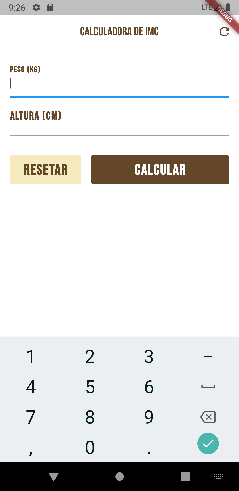

# imc_calculator

<p align="center">
  
</p>

## 🏷️ Sobre

Projeto escrito em Flutter para a disciplina DIM0524 - DESENVOLVIMENTO DE SISTEMAS PARA DISPOSITIVOS MÓVEIS.

## 📦 Como baixar e executar?

```bash
  # Clonar o repositório
  $ git clone https://github.com/antonylemos/imc_calculator.git

  # Entrar no diretório
  $ cd imc_calculator

  # Executar a aplicação
  $ flutter run
```

---

Desenvolvido com 💜 por Antony Lemos 🧑🏽‍🚀